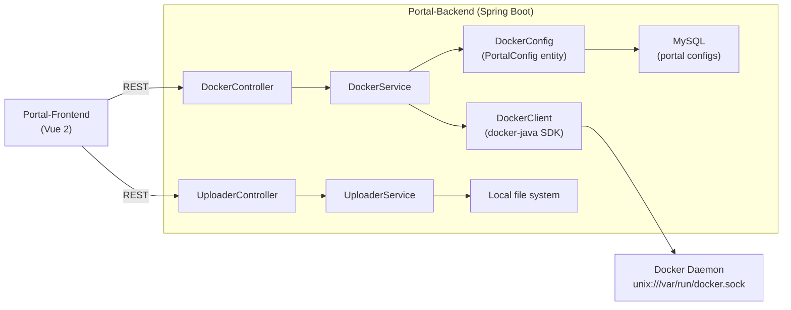

# Portal-Backend · Spring Boot Docker Management + File Upload Backend

> **A Spring Boot REST backend combining Docker container lifecycle management (docker-java SDK) with multi-file upload — backend for the Portal full-stack management portal.**
>
> Spring Boot 后端，集成 docker-java SDK 的容器管理 REST API 与多文件上传，为 Portal-Frontend 门户系统提供后端支持。

[English](#english) · [中文](#中文)


---

<a id="english"></a>

## Architecture



## Quickstart

```bash
# Configure application.properties (DB, docker.host)
mvn spring-boot:run
```

### Key config

```properties
spring.datasource.url=jdbc:mysql://localhost:3306/portal
docker.host=unix:///var/run/docker.sock
file.upload.path=/uploads
```

## API Overview

| Controller | Path | Description |
|---|---|---|
| `DockerController` | `GET /docker/containers` | List containers |
| `DockerController` | `POST /docker/start` | Start container by config |
| `DockerController` | `GET /docker/status/{name}` | Container status |
| `UploaderController` | `POST /upload` | Multi-file upload |
| `UploaderController` | `GET /files` | List uploaded files |

## Technical Highlights

<details>
<summary><b>docker-java SDK integration — typed Docker API</b></summary>

- **S**: CLI-based Docker management requires shell exec with string parsing; fragile and security-risky.
- **A**: `DockerService` uses `DockerClientBuilder` (docker-java) over Unix socket or TCP. Operations return typed `DockerContainers` / `DockerImages` objects; no stdout parsing.
- **R**: Structured error handling, no shell injection surface, API version negotiated at boot.
</details>

<details>
<summary><b>Multi-controller separation — Docker + Upload in one service</b></summary>

- **S**: Container management and file upload are distinct concerns with different auth and validation rules.
- **A**: `DockerController` and `UploaderController` are independent REST controllers backed by separate service interfaces. `DockerConfig` (MyBatis-Plus entity) persists reusable container launch configs in MySQL.
- **R**: Each concern can be extended or secured independently; upload endpoint doesn't require Docker socket access.
</details>

## Roadmap

- [x] Container list, start, status via docker-java SDK
- [x] Multi-file upload + file listing
- [x] MySQL-persisted container launch configs
- [ ] Container stop/remove/restart
- [ ] File deletion and access control
- [ ] Real-time log streaming (SSE)

---

<a id="中文"></a>

## 中文速读

- **是什么**：Portal 门户后端，Spring Boot + docker-java SDK，容器管理（无 CLI 子进程）+ 多文件上传双控制器，MySQL 持久化容器启动配置。
- **亮点**：docker-java 类型化 API 替代 shell exec；`DockerController` 与 `UploaderController` 独立关注点，互不干扰。
- **运行**：配置 `application.properties` → `mvn spring-boot:run`。

## License

MIT © [Seal-Re](https://github.com/Seal-Re)
