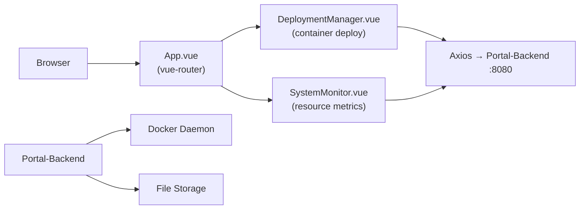

# Portal-Frontend · Vue 2 Docker & File Management UI

> **A Vue 2 + Element UI portal frontend for Docker container management and file upload — deployment manager, system monitor, and file uploader in one SPA.**
>
> 基于 Vue 2 + Element UI 的 Docker 容器管理与文件上传门户前端，集容器部署管理、系统监控、文件上传于一体。

[English](#english) · [中文](#中文)


---

<a id="english"></a>

## Architecture



## Quickstart

```bash
npm install
npm run serve    # dev server at :8080

# production build
npm run build
```

## Features

- Container deployment manager: launch, list, and manage Docker containers
- System monitor: server resource metrics
- File upload interface (pairs with Portal-Backend `UploaderController`)

## Roadmap

- [x] Container deployment UI
- [x] System monitor panel
- [x] File upload
- [ ] Real-time container log viewer
- [ ] Multi-host support

---

<a id="中文"></a>

## 中文速读

- **是什么**：Portal 门户前端，Vue 2 + Element UI，容器部署管理 + 系统监控 + 文件上传。
- **运行**：`npm install && npm run serve`，后端指向 Portal-Backend。

## License

MIT © [Seal-Re](https://github.com/Seal-Re)
